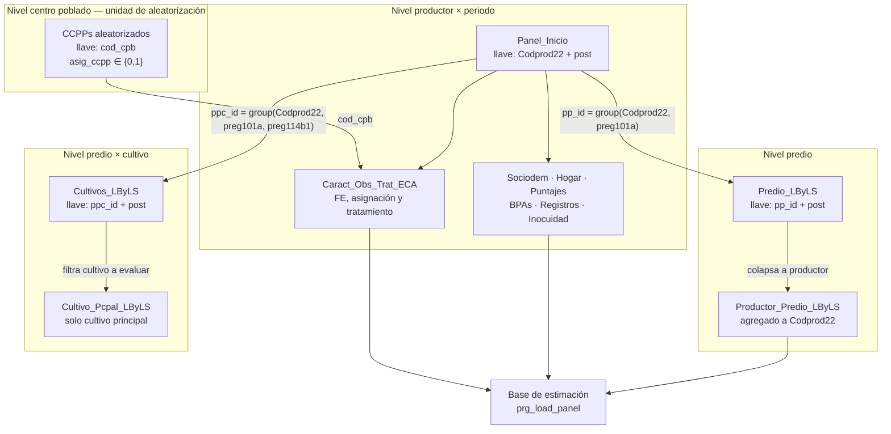

# Mapa de datos — llaves y relaciones entre bases

Qué identifica cada observación y cómo se enganchan las bases entre sí. Es el
documento a leer antes de tocar cualquier `merge`: la mayoría de los errores de
cruce en un panel vienen de asumir la llave equivocada, no de la sintaxis.

## Las cinco llaves

| Llave | Nivel | Cómo se construye | Dónde vive |
|---|---|---|---|
| `Codprod22` | **Productor** | Código de la encuesta 2022. Es seudónimo: no contiene DNI ni nombre | Todas las bases de análisis |
| `post` | **Periodo** | `0` = línea base (2021), `1` = seguimiento (2022) | Todas las bases de panel |
| `pp_id` | **Predio** | `egen pp_id = group(Codprod22 preg101a)` (`E4:362`, `E5:76`) | `Predio_*`, `Valor_Produccion_Predio_*` |
| `ppc_id` | **Predio × cultivo** | `egen ppc_id = group(Codprod22 preg101a preg114b1)` (`E4:108`) | `Cultivos_LByLS` |
| `cod_cpb` | **Centro poblado** | `egen cod_cpb = group(nomb_rgn nomb_prvnc nomb_dstrt nomb_ccpp)` (`E1`) | `Caract_Obs_Trat_ECA` |

`cod_cpb` es la llave de la **unidad de aleatorización**, y por eso es también la
variable de conglomerado de todos los errores estándar del estudio.

## Cómo se relacionan

## Dónde ocurre cada cruce

| Cruce | Script | Llave | Qué resuelve |
|---|---|---|---|
| LB ↔ LS por módulo | `D_merge_panels.do` | `Codprod22` + `post` (+ `preg101a` en parcela, `+ ordp114` en cultivo) | Arma los cuatro paneles |
| Productor ↔ estatus del CCPP | `_helpers/merge_ccpp_status.do` | nombre de CCPP normalizado → `cod_cpb` | Trae la asignación aleatoria |
| Productor ↔ participación en ECA | `_helpers/merge_producer_eca.do` | `dni_prod` (corregido a mano) | Trae el cumplimiento individual |
| Módulos → base de estimación | `_helpers/prg_load_panel.do` | `Codprod22` (m:1) y `Codprod22 + post` (1:1) | Restringe al panel balanceado |

## Dos cosas que conviene no olvidar

**El cruce con los registros de SENASA se hace por `dni_prod`, no por `Codprod22`.**
Es la única llave común entre la encuesta y los registros administrativos, y por
eso existen `_helpers/fix_dni_names.do` y `fix_producer_names.do`: hubo que
corregir DNIs y nombres a mano antes de poder cruzar. En el repositorio público
esos dos archivos van redactados — los valores son datos personales — pero se
publican igual, porque que las bases hayan sido parchadas a mano es información
que hace falta para auditar el pipeline.

**`prg_load_panel.do` restringe al panel balanceado.** Descarta a quien no tenga
observación en ambas rondas. Toda estimación corre sobre esa muestra; la
atrición se analiza aparte, en `I8_balance_attrition.do`.
