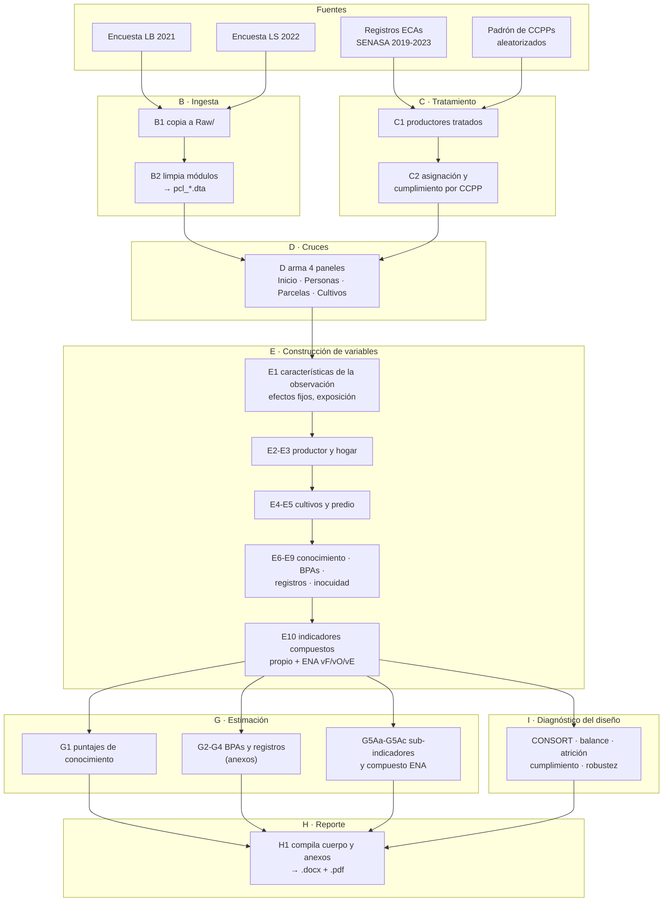

# Pipeline — de las encuestas al reporte

Qué corre, en qué orden, y qué produce cada etapa. El orden autoritativo vive en
`code/run_all.do`; este documento explica por qué está en ese orden.

Para las **llaves y relaciones entre bases**, ver [`data_map.md`](data_map.md).
Para **qué script produce cada tabla**, ver [`table_map.csv`](table_map.csv).

## Punto de entrada

```stata
do code/run_all.do                    // todo el pipeline
do code/run_all.do build              // solo una fase
do code/run_all.do "build estimation" // varias
```

Requiere la global `ECAS` con la ruta a la raíz del repositorio, o correr Stata
desde esa raíz. Ver *Cómo correrlo* en el README.

## Flujo



## Las fases, una por una

| Fase | Scripts | Qué hace | Escribe en |
|---|---|---|---|
| **B · Ingesta** | `B1`, `B2` | Copia las fuentes a `Raw/` y estandariza los nueve módulos de encuesta: limpia strings, convierte categorías negativas a missing, verifica identificadores | `Out/1_`, `Out/2_` |
| **C · Tratamiento** | `C1`, `C2` | Identifica qué productores participaron y qué centros poblados implementaron una ECA. Cruza registros de SENASA con el padrón aleatorizado | `Out/3_` |
| **D · Cruces** | `D` | Arma los cuatro paneles LB-LS y asigna el estatus de tratamiento a nivel de CCPP y de productor | `Out/4_` |
| **E · Construcción** | `E1`–`E10` | Diez módulos temáticos que construyen las variables de resultado y los controles de línea base | `Out/5_` |
| **G · Estimación** | `G1`–`G5Ac` | ITT, DiD y LATE. Escribe las tablas directamente en `.docx` | `Tablas/<tema>/{Cuerpo,Anexo}/` |
| **I · Diagnóstico** | `I1`–`I11` | CONSORT, balance, atrición, cumplimiento, intensidad, robustez al timing | `Tablas/0_Diseño_y_Diagnóstico/{Cuerpo,Anexo}/` |
| **H · Reporte** | `H1` | Compilación final del documento | `Versiones/` |

La fase **F (validación)** está vacía desde el 2026-08-12: `F1_test_balance.do`
se retiró porque su tabla no está en el reporte y su función quedó cubierta por
`I4`, `I5` e `I6`. La letra se reserva.

## Por qué ese orden

`E1` va primero dentro de su fase porque construye los efectos fijos (estrato
región × cultivo, centro poblado, mes de encuesta) que todas las demás consumen.
`E4` va antes que `E5` porque el predio necesita el valor de la cosecha que
calcula el módulo de cultivos. `E10` va al final porque los indicadores
compuestos se arman sobre lo que producen `E7`, `E8` y `E9`.

`H1` concatena las secciones `.docx` ya terminadas —con sus tablas y figuras
embebidas— y **no reconstruye ninguna tabla**. Lee de `Secciones/`, no de
`Tablas/`, así que regenerar tablas nunca cambia el consolidado: para que un
resultado nuevo llegue al reporte hay que insertarlo antes en la sección que
corresponda. En el orden por defecto `reporting` corre *antes* que
`diagnostics`, y da lo mismo, justamente por eso.

## Dependencias entre fases

Cada script declara en su cabecera qué lee (`Input`), qué escribe (`Output`) y de
qué helpers depende (`Depends`). Esa cabecera es la fuente de
[`table_map.csv`](table_map.csv), que se regenera con:

```bash
python code/_utils/build_table_map.py
```

El generador además **verifica cada salida declarada contra el disco**. Una
declaración sin archivo correspondiente es una señal, no ruido: así se detectó
que `H2_plot_yield_outliers.do` declaraba `.png` cuando exportaba `.emf` —y, al
revisarlo, que sus gráficos no aparecían en el reporte, lo que llevó a
retirarlo—; y así se cazaron las cabeceras que quedaron desactualizadas al
reorganizar las carpetas de tablas.
